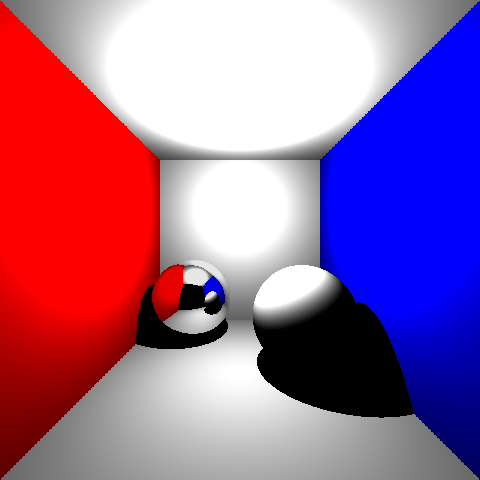
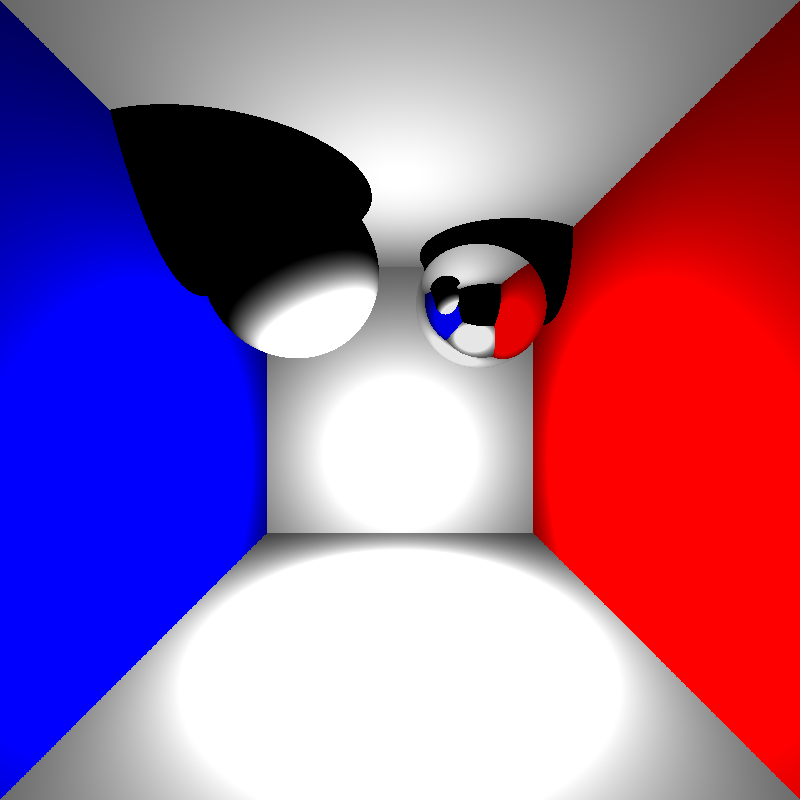
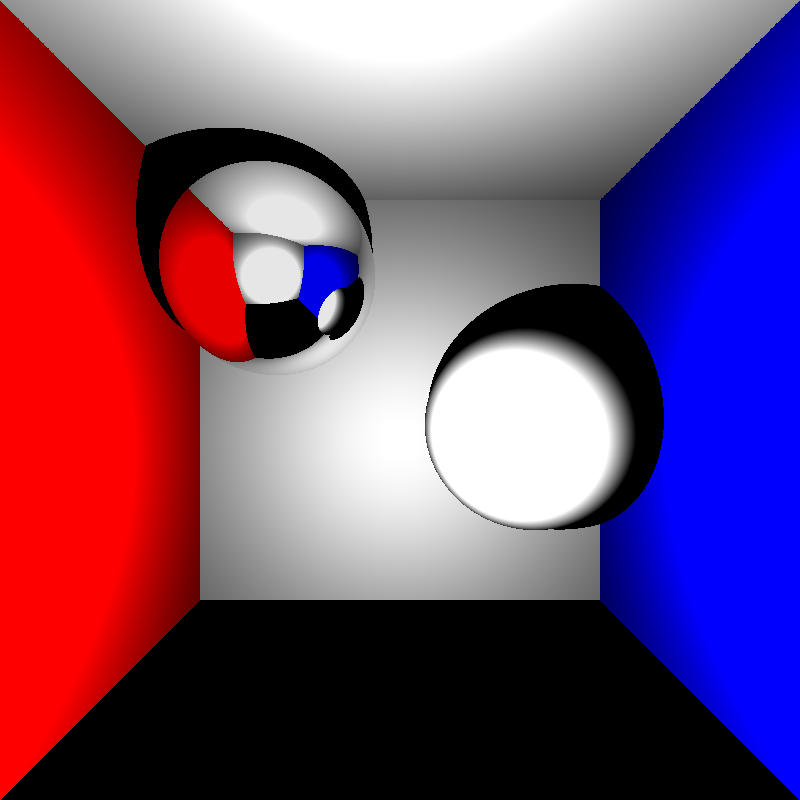
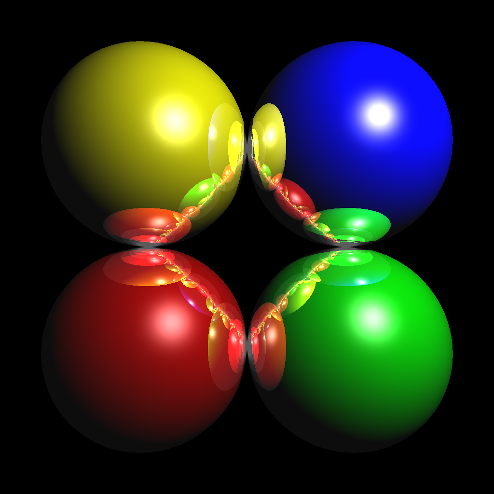
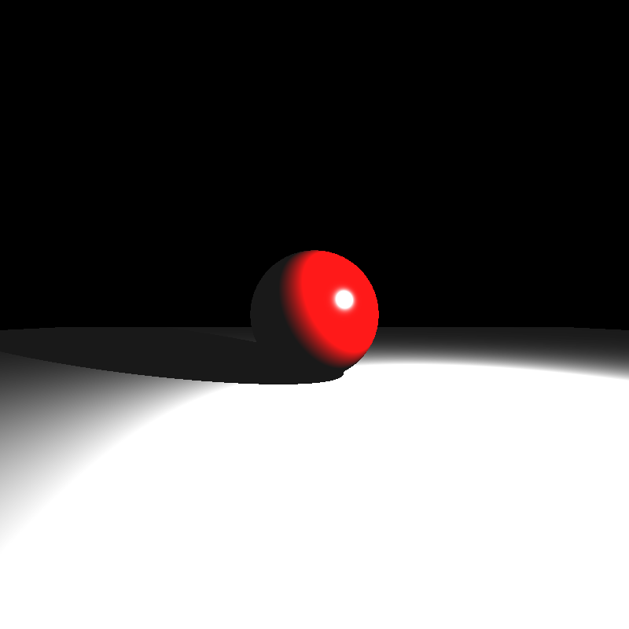

# RAYTRACING HOMEWORK CENG477

In this homework, we implemented a raytracer and rendered some scenes with it.
My solution was not very efficient because I did not use concepts like bounding
volume hierarchy. Here are some the outputs;

**BUNNY**

**CORNELLBOX IMAGES**

**MIRROR SPHERES**

**SPHERE**

